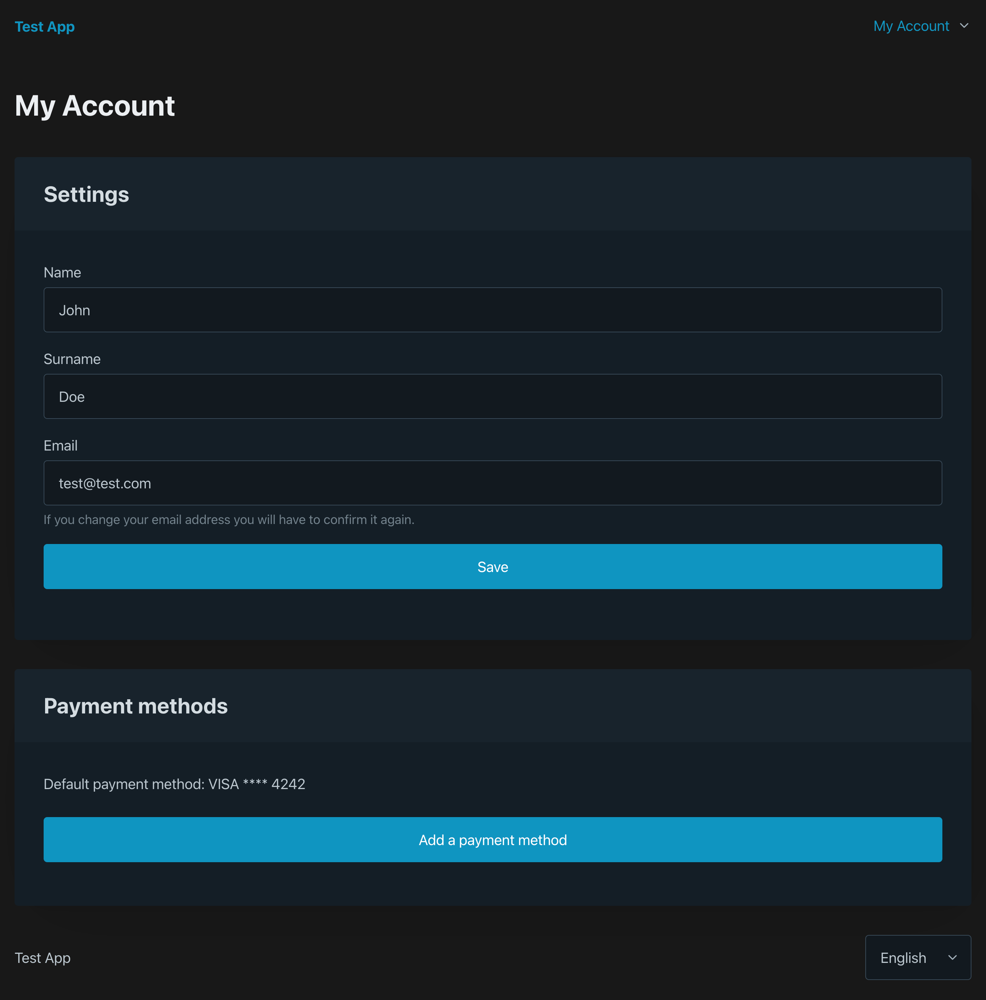

# Vue3 starter kit

Arguably the most important parts of an app (authentication and handling payment methods) are also the most repetitive and boring to implement. This starter kit aims to solve that problem by providing a solid foundation for your next Vue3 app.



## Demo
https://vue3-starter-demo.netlify.app **(Note: this is a pure client-side demo so there is no backend - you won't be able to login or test payment methods)**

See the components below for a more detailed preview.

## Preview components in Storybook
https://vue3-starter-storybook.netlify.app/index.html

## Comes with

- [Vue Router](https://router.vuejs.org) for routing
- [Pinia](https://pinia.vuejs.org) for state management
- [Stripe](https://github.com/ectoflow/vue-stripe-js) for payment processing
- [GateKeeper](https://github.com/M-Media-Group/Vue3-GateKeeper) for protecting routes and used in the [ConfirmGate](src/components/modals/ConfirmsGate.vue) component
- [Meta-Tags](https://github.com/M-Media-Group/Vue3-Meta-Tags) for managing meta tags
- [i18n](https://github.com/intlify/vue-i18n-next) for internationalization
- [Google Analytics](https://github.com/MatteoGabriele/vue-gtag) for analytics
- [PicoCSS](https://picocss.com) for semantic CSS

## Features

- Highly performant and flexible
- Widely tested with Unit, Visual, and E2E tests
  - Includes Github Actions for CI running both types of tests
  - Includes all fixtures and mocks needed for testing
  - Includes unit-test coverage reports
- Doesn't force any CSS frameworks (HTML written semantically and tests use semantic selectors), but comes with Pico CSS for a quick start
  - Supports Dark Mode
  - Only 8 classes currently used (rest relies on semantic selectors) so super easy to replace
- Written with Composition API in Vue3 and Typescript
- Support for Pinia with a pre-made User store, Vue Router, Vue i18n, and Axios
- Comes with internationalization support out of the box (English and French to start with)
- Includes a Dev-Container for development in a Docker environment (optional)
- CSRF cookie protection support
- Semantic HTML5 elements
- Content-Security-Policy (CSP) support
- All API calls in a single file for easy customization (the User store)
- Global event bus for easy communication with things like Analytics services
- Syncing of authentication states and languages across tabs using broadcastMessage (if you change it on one tab, all other open tabs with the same app running will also update)
- VSCode launch configuration so you can use breakpoints in your debugging
- Includes Storybook for easy isolated component preview and development

### Pages and routing

- User settings page with a section to add payment methods using Stripe Elements
- Login, logout, register pages
- Forgot password, reset password, resend email confirmation, password confirmation, payment method adding pages
- [Gates](https://github.com/M-Media-Group/Vue3-GateKeeper) for GateKeeper including: auth, guest, confirmedEmail, confirmedPassword, hasPaymentMethod
- Auto meta-tags and schema markup handling for SEO including internationalization support using [Vue3-Meta-Tags](https://github.com/M-Media-Group/Vue3-Meta-Tags)

### Forms

Forms are split into separate components so they can be used either on pages (like a login page) or in modals (like a login to continue modal).

The following forms are included:

- Login or register
  - Form that checks if a user email exists, and shows a login or registration form based on previous result
- Reset password
- Forgot password
- Confirm password
- Account settings
- Add payment info
- Create personal access token

### Components

#### BaseForm

A helper component that makes it easy to create forms with validation. It's a wrapper around native browser validation.

Props:

- submitText: string - The text to display on the submit button
- disabled: boolean - Whether the form is disabled or not
- isLoading: boolean - Whether the form is loading or not
- showSubmitButton: boolean - Whether to show the submit button or not

Methods that can be called (make sure to set a ref on the BaseForm):

- checkValidity - check the validity of each input in the form at once
- setInputErrors - pass a JSON object with the input names as keys and the error messages as values. The values can also be an array (this is how Laravel returns errors from the backend, for example)
- focusOnFirstInput - focus on the first input element in the form
- setSuccessOnInputs - sets aria-invalid to false on valid inputs, which in turn renders a green border with PicoCSS. Will clear after 5 seconds, just like native browser errors

Slots:

- default - the form content
- submit - the submit content (will replace the default submit button)
  - The slot provides the submitText, submit (method), disabled, and isLoading props that you can use

#### BaseButton

Automatically render a `button`, `a` with a role of `button`, or `router-link` depending on the props passed (if `href` its an `a`, if `to` its a `router-link`, otherwise its a `button`)

Props:

- to: string - The route to link to (optional)
- href: string - The href to link to (optional)

Slots:

- Default slot - The text to display in the button

#### BaseModal

Render a modal with an optional backdrop and close button.

Props:

- title: string - The title of the modal
- allowBackgroundClickToClose: boolean - allow clicking the background to close the modal
- showFooter: boolean - show the modal footer
- showCloseInHeader: boolean - show the close button in the header
- showTrigger: boolean - show the trigger button

Slots:

- default - the modal content
- trigger - the trigger button
- footer - the modal footer

### Continuous Integration and Continuous Deployment

- Env file support
- Github Actions for CI to run unit and end-to-end tests
- Netlify TOML file for easy deployment on Netlify
- CI validation for missing translation keys
- Pre-push (or pre-commit if you want) hooks for linting and testing right before pushing
- Secrets leak detection during lint process

## Project Setup

This starter kit is actively tested with and recommends using Node 20.

```sh
npm install
```

Make sure to copy the `.env.example` to `.env.local` and fill in the values.

After installing everything - you should run the E2E tests to make sure everything is working properly. See the [E2E tests section](#run-end-to-end-tests-with-cypress) for more information.

### Your first changes
This starter kit is designed to provide a strong test foundation. When you'll change something in the code that will modify the element itself (changing the text for example), your snapshot and visual tests will fail. You can easily update snapshots with the commands provided in the starter kit (read below). This kind of workflow is very useful because it ensures that changes are intentional and that you are aware of them.

#### Other significant changes to make
- index.html: change the Content Security Policy (CSP) to match your needs, and remove the noindex meta tag

### Compile and Hot-Reload for Development

```sh
npm run dev
```

Wether you are using the Docker environment or not, you should now be able to access the app at `http://localhost:8001`.

### Type-Check, Compile and Minify for Production

```sh
npm run build
```

### Run Unit Tests with [Vitest](https://vitest.dev/)

```sh
npm run test:unit
```

### Run End-to-End Tests with [Cypress](https://www.cypress.io/)

```sh
npm run test:e2e:dev
```

This runs the end-to-end tests against the Vite development server.
It is much faster than the production build.

But it's still recommended to test the production build with `test:e2e` before deploying (e.g. in CI environments):

```sh
npm run build
npm run test:e2e
```

Note that there seems to be an issue when trying to run this command in a pre-commit/push hook - see similar issue here: https://stackoverflow.com/questions/73108965/module-not-found-error-when-adding-cypress-command-to-husky-pre-push

### Lint with [ESLint](https://eslint.org/)

```sh
npm run lint
```

### Translation keys validation

```sh
npm run translation-key-check
```

Note, if you expand the supported languages, make sure to update the `.vue-translation.js` file to include the new language.

### Storybook Components

```sh
npm run storybook
```

This will start the Storybook server and open a new tab in your browser.

You can read more about Storybook [here](https://storybook.js.org/).

### Run Visual Tests with [Storybook](https://storybook.js.org/)

```sh
npm run test:visual:ci
```

If you already have torybook running, you can run the visual tests with:

```sh
npm run test:visual
```

When something changes (intentionally) in the components visually, you can regenrate the baseline images with:

```sh
npm run test:visual:update
```

## Backend setup

This starter kit was designed to work with a Laravel based backend, but any backend that implements the required functionality would work.

Assumptions made by this starter kit:

- The backend is powered by Laravel Fortify and Sanctum
  - Check out our complementary [Laravel-SPA package](https://packagist.org/packages/mmedia/laravel-spa) that sets up some backend stuff for you
  - You should still setup Cashier and the routes for `user/payment-methods` and `user/payment-intent` yourself; see the User store for details
- The user object is the one that can make payments (some apps may need to do this on team models or other models instead)
  - Using Stripe as the payment provider
  - Using Pico CSS variables for styling. You do not need to use Pico, but if you change it you might have to update some CSS variables especially ones passed to Stripe Elements

## Contributing

### Test driven approach

We use a test driven approach for this starter kit.

You should almost never modify existing tests. Any modified tests will require merge approval.

If you find a bug, first write a test that will fail because of the bug. Then fix the bug and make sure the test passes.

If you want to add a new feature, write a test that will fail because of the missing feature. Then add the feature and make sure the test passes. New tests do not require approval.

<!-- Show image https://res.cloudinary.com/practicaldev/image/fetch/s--2bUj5oX1--/c_limit%2Cf_auto%2Cfl_progressive%2Cq_auto%2Cw_880/https://dev-to-uploads.s3.amazonaws.com/uploads/articles/26tdj40bmlnmw09fb27h.png -->

#### Using the right tests for the job

In visual testing, you generally go from the smallest component (e.g. testing a button) to the largest, while in E2E tests you go from the largest (e.g. testing a whole page) to the smallest. Unit tests test your logic in between.

1. For functionality, use unit tests (e.g. if I give this value to this function, will it return the correct result?)
2. For user interactions, use end-to-end tests (e.g. if I click this button, will it show the correct modal?)
3. For visual changes, use visual tests with Storybook (e.g. if I change this CSS, will I still see the element in the correct place? Will it still be centered?)

Be careful not to over-test. If you find yourself testing the same thing in multiple places, you should ask yourself if you are testing the right things in the right places. Over-tested code can be hard to update and grow.

##### Test questions - example of a card

- Visual test: does this card show a pointer cursor when I hover over it?
- Unit test: does this card have a correct `href` when I pass a link to it?
- End-to-end test: Is this card linking to the right place for the given page it is currently on?

##### Test questions - example of a modal

- Visual test: Is this modal centered on the screen?
- Unit test: Does this modal have the correct title when I pass a title to it?
- End-to-end test: Does this modal show the correct content when I open it on a specific page?